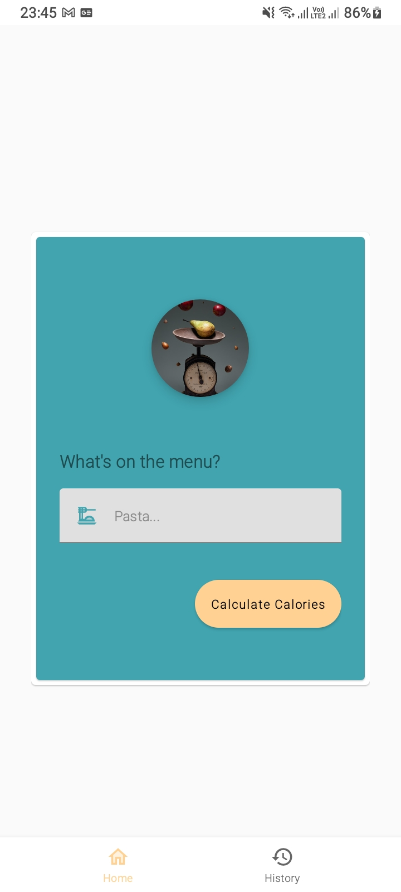
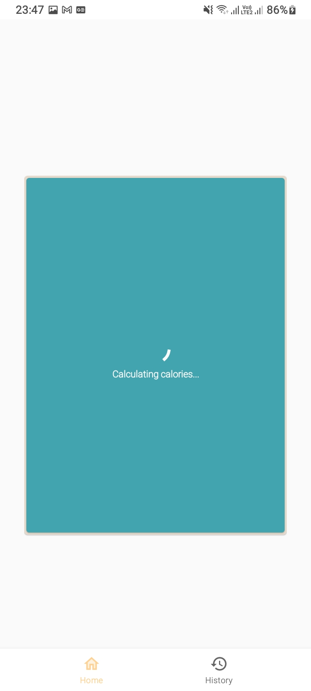
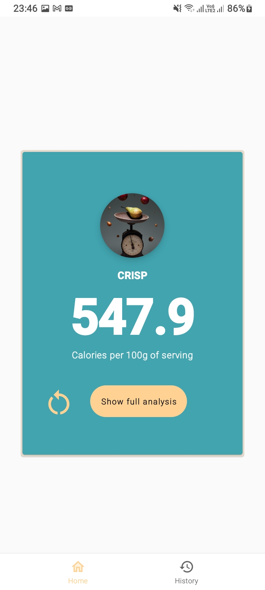
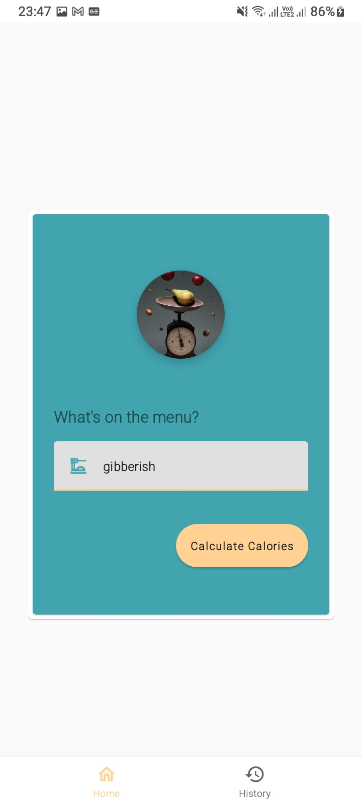
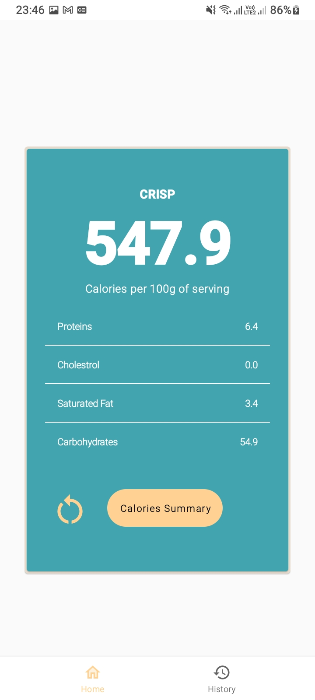
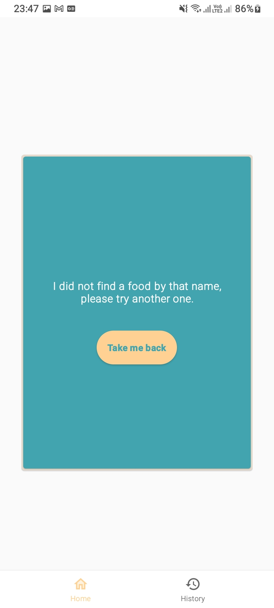
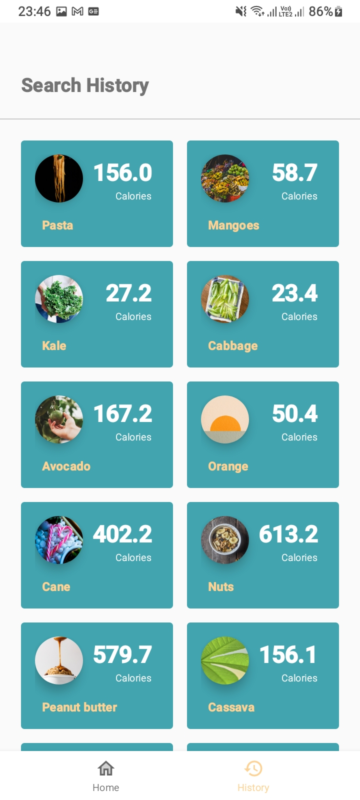
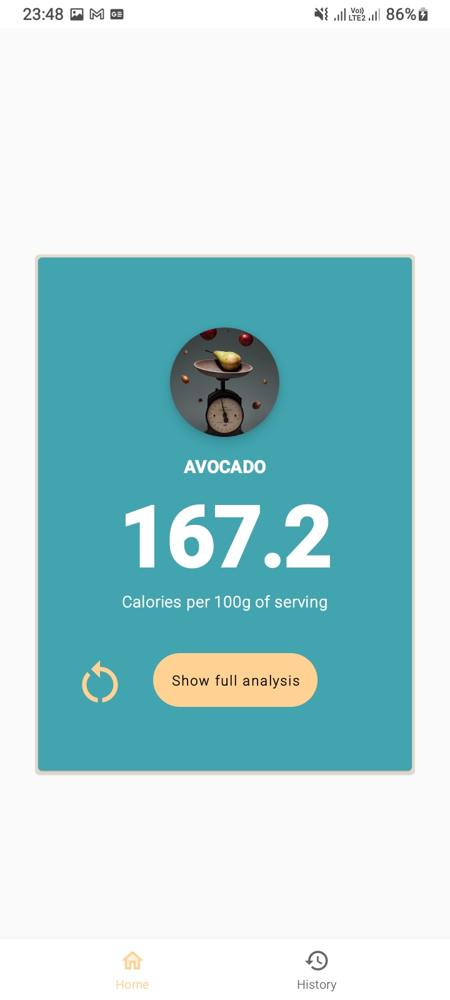

 

## Afya Calories App

An Android App that calculates the calories of a given food, submitted in string format. The app
uses the [CaloriesNinja API](https://calorieninjas.com/api) to calculate the calories content of the
specified food. To spice up the UI, an image of an entry is randomly picked
from [Unsplash](https://unsplash.com/) when the food is calculated for the first time (sometimes the
images are not appropriately foodish).

Min API Level: 26 Build

System: [Gradle](https://gradle.org/)

## Table of Contents

- [Architecture](#architecture)
- [Libraries](#libraries)
- [Testing](#testing)
- [Demo](#demo)
- [Assumptions](#assumptions)
- [Improvements/TODO](#improvements)

## Architecture

The application follows
the [Clean](https://blog.cleancoder.com/uncle-bob/2012/08/13/the-clean-architecture.html) [MVVM](https://developer.android.com/topic/libraries/architecture) architecture powered by Android
  Architecture Components.

The app is split into data, domain and ui layer with mappers facilitating the transfer of data
between the different layers. Although the layers are conceptually three, I am only using two
modules; combining the data and domain layer into one module. This is more of a preference, really.

## Libraries

- [Android Jetpack](https://developer.android.com/jetpack)
  - [Navigation Component](https://developer.android.com/guide/navigation/) - preferred library for
  app navigation, fragment management and passing data between screens with support
  from [Safe Args](https://developer.android.com/guide/navigation/navigation-pass-data#Safe-args)
  - [Room Database](https://developer.android.com/training/data-storage/room/) - Cache calculation
  to build users history.
  - [Data Binding](https://developer.android.com/topic/libraries/data-binding) - For reactive
  views; binding views to the ViewModels
  - [ViewModel](https://developer.android.com/topic/libraries/architecture/viewmodel) - For state
  management.
  - [LiveData](https://developer.android.com/topic/libraries/architecture/livedata) -
  Facilitates UI related reactivity.
- [Glide](https://github.com/bumptech/glide) - Loading Images to views and caching for later.
- [Retrofit](https://square.github.io/retrofit/) - Preferred library for HTTP processing.
- [Kapt](https://kotlinlang.org/docs/kapt.html#using-in-gradle) for annotation processing.
- [Moshi](https://github.com/square/moshi) - Preferred JSON mapper.
- [Truth](https://truth.dev/) - Preferred assertion framework for tests.
- [Robolectric](http://robolectric.org/) - Facilitate AndroidX tests for UI simulation.

## Testing

WIP. Only tests that have been done are related to UI (ViewModels). More tests to be added later.

## Demo

|||
|||
|||
|||

## Assumptions
- The right Git conventions were not followed
- Only basic edge cases were handled

## Improvements
- Currently, dependency injection is done manually. It would be nice to use a library.
- Error handling should be done in a better way, maybe using a Result class?
